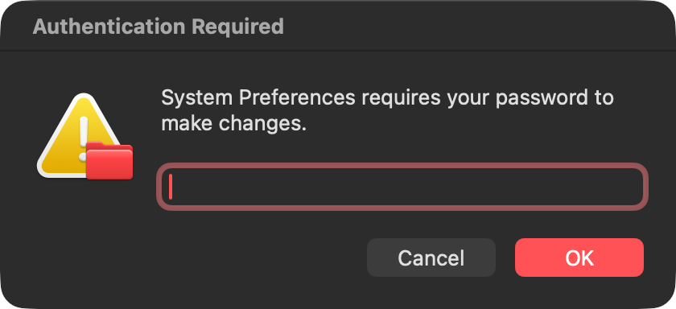
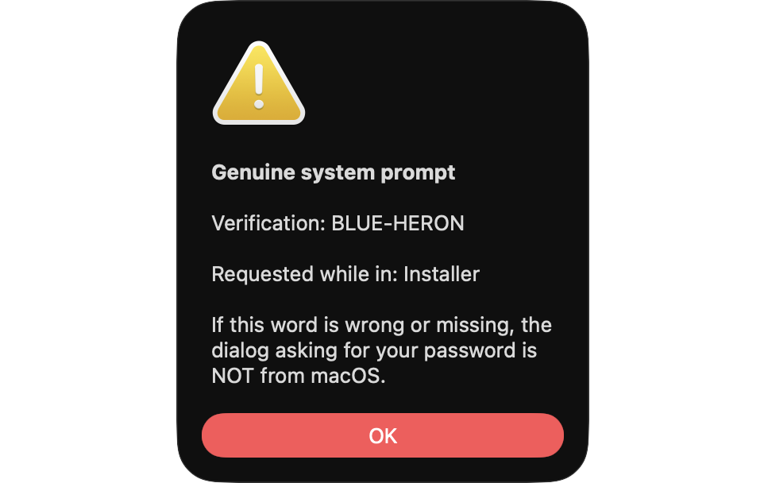
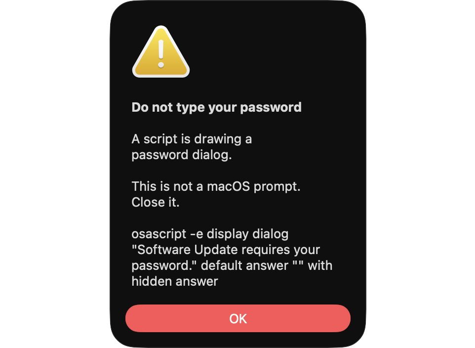

# prompt-verify

Tells you whether a macOS password dialog is genuine.

## The problem

Malware on macOS asks for your admin password by drawing a dialog that looks
exactly like the system's own. It is a well documented technique: a few lines
of AppleScript produce a window with a hidden text field, the right wording and
the right icon, and whatever you type goes straight to the attacker.



That dialog is fake. It was produced by a single line of AppleScript, and
anything typed into it is handed to whoever ran the script.

Advice usually amounts to "look carefully." That does not work. A copy can be
pixel-perfect, and you are asked to spot the difference while distracted.

## The approach

Stop trying to recognise the fake. Confirm the real one instead.

Genuine authorization prompts are drawn by system processes (`SecurityAgent`,
and the LocalAuthentication service for System Settings) that an application
cannot start or impersonate. Whenever it appears, prompt-verify
shows an alert containing **a word you chose during setup**.

An attacker can copy the dialog. They cannot produce your word.

**No word, no password.**

The personal token matters because the alternative — noticing that no
notification appeared — is passive, and people are poor at noticing absence.
A word you actively look for is something you check.

prompt-verify also watches for the attack directly: a scripted dialog asking
for credentials is flagged the moment it appears.

## Install

```sh
git clone https://github.com/williamcolegithub/macos-prompt-verify
cd macos-prompt-verify
swiftc -O src/alert.swift -o bin/pv-alert     # optional, see below
./bin/prompt-verify setup                     # choose your word
./bin/prompt-verify install                   # run at login
```

Building `pv-alert` is optional but recommended. Without it, alerts fall back
to AppleScript, which opens them on whichever display the active application is
using — on a multi-monitor desk that means a security warning can appear on a
screen you are not looking at. The helper pins alerts to the built-in display.

## Commands

| Command | Does |
| --- | --- |
| `setup` | Choose your word and preview a genuine alert |
| `install` | Run the watcher at login |
| `check` | Is the dialog on screen right now genuine? |
| `status` | Word set, watcher state, recent events |
| `uninstall` | Stop the watcher and delete the word |

`check` exits 0 for genuine, 1 for no prompt active, 2 for a detected fake, so
it can be used from other scripts.

## What you will see

**A genuine prompt** produces an alert on your built-in display containing your
word and the application that was in front when it appeared:



**A scripted fake** produces a different alert naming the process that drew it:



Everything is logged to `~/.prompt-verify/events.log` whether or not you saw
the alert.

## Threat model

**What this stops.** Commodity malware that shows the same fake dialog to
everyone it infects. It does not know your word, so its dialog arrives without
one. This is the realistic threat: one payload shipped widely, not something
built around you.

**What this does not stop.** An attacker already running code as your user can
read the token — it lives in your login keychain, and your own script has to
read it too. Keychain storage means the access has to be requested rather than
taken from a plain file, which is a small obstacle, not a wall. Anyone
targeting you specifically can defeat this.

That is a real limitation, and it is the honest reason to treat prompt-verify
as one layer rather than a guarantee.

**What it cannot see.** A dialog drawn by compiled code rather than a script
will not be caught by the direct detection. It will still lack your word, which
is the part that matters.

**Touch ID is unverified.** If authorization completes by fingerprint, the
prompt may not go through `SecurityAgent`, in which case no alert appears for a
prompt that is real. Treat a fingerprint prompt as outside this tool's scope
until you have confirmed the behaviour on your own machine.

**It is detection, not prevention.** Nothing here stops malware that is already
running, and malware running as you can read your keychain without asking for
anything.

## Notes

`launchd` cannot execute anything inside `~/Documents` or `~/Desktop`; a job
pointed at those folders exits 126 with no explanation. `install` copies the
script to `~/.prompt-verify/bin` and runs it from there.

Alerts use a sound and a modal window rather than a notification, because
notifications are suppressed by Focus — which is exactly when you would miss
one.

## Prior art

[Objective-See](https://objective-see.org)'s BlockBlock covers persistence
monitoring properly and is what you want for that. [Splunk publishes a
detection](https://research.splunk.com/endpoint/d565ae18-7db6-460c-a2eb-a7109f18bc5e/)
for scripted credential dialogs, and the spoofing technique is documented
[here](https://embracethered.com/blog/posts/2021/spoofing-credential-dialogs/).

What prompt-verify adds is the inversion — confirming the genuine prompt with a
secret the attacker cannot know, rather than trying to identify the fake.

## License

MIT
